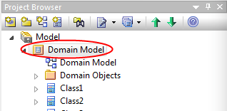
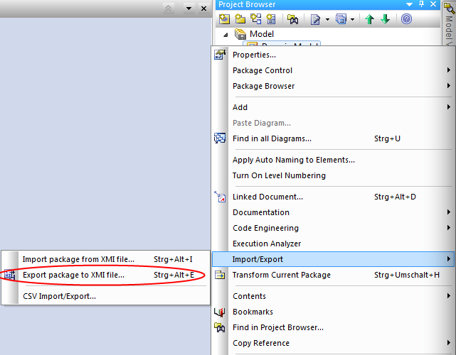
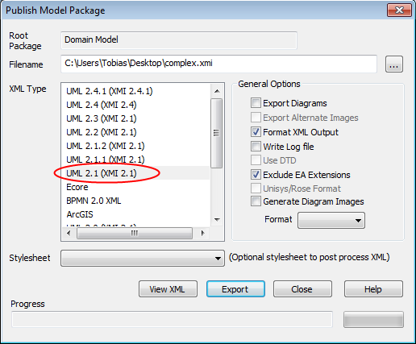

EA Reader Dokumentation
=======================

### Seerhein-Lab
### Mai 2013 – Juli 2013
### Norbert Kunstek
### Tobias Keh

Einführung
----------
Das Ziel des Projekts ist es, ein Datenbankschema in einem UML Werkzeu
zu modellieren und daraus eine Schemadefinition für einen Java OR-Mapper
zu erzeugen. Dafür soll als UML-Werkzeug Sparx Enterprise Architect
und als OR Mapper Torque verwendet werden.
Da das manuelle Erstellen des Schemas mit viel Arbeitsaufwand verbunden ist, 
kann hierbei durch Einbindung in den Workflow die Automatisierung 
der Arbeitsabläufe deutlich erhöht werden. 
Für kommende Versionen ist hierfür ein entsprechendes Maven Plug-In angedacht.
 Damit wäre dann die Ausführung durch einen Build-Server möglich.
 Ein weiterer Vorteil dieses Vorgehens besteht darin,
 dass das Klassen-Diagramm somit gleichwertig zum Schema ist.
 Änderungen werden immer direkt am Klassen-Diagramm vorgenommen
und dieses ist somit immer auf dem aktuellsten Stand. 
Bei manueller Erstellung des Schemas hat das Klassen-Diagramm lediglich eine 
dokumentierende Funktion und die Wahrscheinlichkeit ist sehr hoch,
dass auf Grund des größeren Aufwands die Versionen des Klassen-Diagramms
und des Schemas divergieren.

Lösungsansätze
--------------
Gesucht ist eine Möglichkeit, das vom Enterprise Architect exportierte
UML Klassen-Diagramm im EA Reader zu importieren.
Hierzu gibt es eine Vielzahl an Möglichkeiten.
Es gibt schon vorhandene Projekte, mit denen zusätzlich noch Programmcode
generiert werden kann, wie zum Beispiel KISSMDA oder AndroMDA. 
Da dies für das Projekt aber nicht benötigt wird,
haben wir folgende fünf Möglichkeiten betrachtet

1. Export im Ecore Format und Import mit Eclipse EMF
2. Export im XMI Format und Import mit Eclipse EMF
3. Export im XMI Format und Import mit Eclipse UML2
4. Export im XMI Format und manuelles Parsen des Exports
5. Direktes Einlesen der Enterprise Architect Datei über die Sparx Java API

### 1. Ecore

_Pro_

Die Erstellung des Exports in das Ecore Format ist sehr einfach möglich. 
Die nötigen Einstellungen können im EA vorgenommen werden. 
Das Auslesen in Java ist ebenfalls sehr einfach möglich
und die Informationen sind einfach zugänglich. 
Des Weiteren wird das Ecore Format vom Eclipse Modeling Framework (EMF)
zur Persistierung benutzt. 
Daher wäre diese Möglichkeit des Exports interessant,
sofern man mit EMF an dem Export weiter arbeiten möchte. 

_Contra_

Der Enterprise Architect exportiert nur einen Bruchteil der im Diagramm 
enthaltenen Informationen in die Ecore Export Datei. 
Daher ist diese Lösung nicht zu gebrauchen.

### 2. EMF

_Pro_

Die Erstellung des Exports in das XMI Format ist im Enterprise Architect
sehr einfach möglich.
Die Informationen sind über Java und das EMF Eclipse Modeling Framework
relativ einfach zugänglich.

_Contra_

Allerdings ist das EMF zur Modellierung gedacht, 
weshalb es die von uns benötigte Funktionalität bei weitem übersteigt.
 Prinzipiell hätten wir diese Möglichkeit wählen können,
 allerdings hat sich mit UML2 noch eine bessere Möglichkeit ergeben.

### 3. UML2

_Pro_

Die Erstellung des Exports in das XMI Format ist im Enterprise Architect 
sehr einfach möglich.
Die Informationen sind in Java über die UML2 Bibliothek sehr einfach
zugänglich.
Eclipse UML2 ist eine UML Implementierung von Eclipse basierend auf EMF. 
Da es sich beim Import um UML Klassendiagramme handelt,
bietet sich dieser Lösungsansatz an.
Beim Import wird ein entsprechender Objektgraph erstellt,
mit dem dann gearbeitet werden kann. 
Beinahe alle benötigten Informationen werden beim Import übernommen
und stehen beim Mapping auf das Torque Schema zur Verfügung.

_Contra_

Vereinzelte Informationen wie maximale Länge eines Attributs
oder Information darüber, ob ein Attribut Primärschlüssel ist oder nicht,
müssen im Vorfeld des XMI Imports mittels einer Transformation
über entsprechende XMI IDs zugeordnet werden. 
Außerdem müssen alle zusätzlich vom Enterprise Architect
angebotenen Informationen deaktiviert werden, 
was allerdings einfach möglich ist.

### 4. Manuell parsen

_Pro_

Die Erstellung des Exports in das XMI Format ist im Enterprise Architect
sehr einfach möglich.
Da man den Parser selbst programmiert, hat man die volle Kontrolle
über die Informationen, welche aus dem Enterprise Architect Export
in das Programm importiert werden. 
Dadurch sind die Informationen relativ leicht zugänglich. 

_Contra_

Allerdings ist der Entwicklungs-/Wartungs- und Weiterentwicklungsaufwand
im Vergleich zu den anderen Lösungen viel zu hoch.
Da der Enterprise Architect kein reines standard-XMI exportiert,
liegt die Vermutung nahe, dass sich der Export folgender Versione
mehr oder weniger vom aktuellen Export Format unterscheidet 
und somit eine Verwendung einer dieser Versionen
einen entsprechend hohen Arbeitsaufwand nach sich zieht.

### 5. Sparx Java API

_Pro_

Die Verwendung der von Sparx angebotenen Java API ist eigentlich die eleganteste.
Da man direkt auf die Enterprise Architect Datei zugreift,
ist ein extra Export und Import im Programm überflüssig.
Des Weiteren hat man keinen Aufwand bei der Wartung, 
da dies (vermutlich) von Sparx durchgeführt wird. 

_Contra_

Was sich als unüberwindbare Hürde herausgestellt hat ist die Tatsache,
dass die Sparx Java API auf die Verwendung einer DLL
und der Java Version 5, 32 bit angewiesen ist. 
Dadurch ist die Plattformunabhängigkeit von Java Anwendungen hinfällig.

### Entscheidung

Die Entscheidung ist auf die Lösung mit dem Export des Diagramms im XMI Format
und dem Import ins Java Programm über die Eclipse UML2 Bibliothek gefallen.
Hierbei ist der Entwicklungs- und Wartungsaufwand
und die manuelle Bearbeitung des Exports vertretbar
und die Plattformunabhängigkeit wird gewahrt.

Arbeitsablauf
-------------

### Benötigte Programme und Versionen

#### Mindestanforderungen

* Java J2SE-1.5, 32 oder 64 bit
* Enterprise Architect Version 8 oder höher

#### Vorgehen im EA

Folgende Vorgehensweise beim Arbeiten mit dem Enterprise Architect
ist sehr wichtig da es ansonsten zu Problemen bei der Verwendung des EA Readers
kommen kann.

Schritte zum Export des UML Klassendiagramms aus dem Enterprise Architect:

1. Rechtsklick auf Domain Model -> Import/Export

2. Publish

3. XMI Version 2.1 wählen

4. EA Graphiken exportieren -> uncheck

5. Exclude EA Extensions -> check

6. Klick Export

#### Probleme

Wenn die beiden Optionen Export Diagrams und Exclude EA Extensions 
nicht unchecked beziehungsweise checked werden, 
kommt es beim Einlesen über die Eclipse UML2 Bibliothek zu Fehlern, 
da die Bibliothek den Input nicht interpretieren kann 
und den Objektgraphen nicht erstellt.

Funktion Reader
---------------

### Transformator

#### Anpassung der Datentypen

Da der Enterprise Architect keine Java konformen Datentypen ausgibt,
ergänzt der Transformator in einem ersten Schritt die XMI Export Datei
mit einem Abschnitt, in dem den Enterprise Architect Datentypen
entsprechende Java Datentypen zugeordnet werden:
> <xmi:Extension extender="Enterprise Architect" extenderID="6.5">
>   <primitivetypes>
>     <packagedElement name="EA_PrimitiveTypes_Package"
>       visibility="public" xmi:id="EAPrimitiveTypesPackage"
>       xmi:type="uml:Package">
>         <packagedElement name="EA_Java_Types_Package"
>           visibility="public" xmi:id="EAJavaTypesPackage"
>           xmi:type="uml:Package">
>             <packagedElement name="int" visibility="public"
>               xmi:id="EAJava_int" xmi:type="uml:PrimitiveType"/>
>             <packagedElement name="String" visibility="public"
>               xmi:id="EAJava_String" xmi:type="uml:PrimitiveType"/>
>         </packagedElement>
>     </packagedElement>
>   </primitivetypes>
> </xmi:Extension></xmi:XMI>

#### Ergänzung der Schlüsselattribute

Die Schlüsselattribute sind in der XMI Export Datei über XMI IDs
als Custom Profile eingetragen und nicht als Attributeigenschaft isID="true".
Daher ergänzt der Transformator diese Attributeigenschaft
bei den Schlüsselattributen.

> <packagedElement name="Class1" visibility="public"
>   xmi:id="EAID_9F0EBB09_7974_41f4_B1E9_D9EBB2099E6D"
>   xmi:type="uml:Class">
>     <ownedAttribute isDerived="false" isDerivedUnion="false"
>       isID="true" isOrdered="false" isReadOnly="false" isStatic="false"
>       isUnique="true" name="class1_ID" visibility="private"
>       xmi:id="EAID_85F5481E_795C_4c93_A204_F71B3AC0CFBA"
>       xmi:type="uml:Property">`
      
#### Ergänzung der Längenangaben der Attribute

Die Angabe der maximalen Länge der einzelnen Attribute ist im Enterprise Architect
nicht von Haus aus möglich, daher werden sie als Custom Profile abgespeichert und exportiert.
Da die UML2 Bibliothek diese Werte so nicht einlesen kann, sucht der Transformator
analog zu der Zuordnung der Schlüsselattribute die entsprechenden Werte 
und ordnet sie den Attributen unter ??? zu. 
(Muss noch ergänzt werden, fehlt noch im EA Reader)

#### Einlesen als UML2 Repository

Die XMI Export Datei wird nach der Bearbeitung durch den Transformator
mit Hilfe der Eclipse UML2 Bibliothek eingelesen. 
Dabei wird ein sogenanntes UML2 Repository erstellt, 
in das das UML Klassendiagramm eingelesen und von Java Seite aus zugreifbar macht.
Dieser Objektgraph beinhaltet Modelle, die wiederum aus Klassen,
Assoziationen und Vererbungen bestehen. 
Diese beinhalten dann wiederum spezifische Attributwerte.
(Angabe des Speicherorts der EA Export Datei fehlt noch)

#### Auslesen und Mapping auf Torque Schema

Dieser Objektgraph wird mehrfach durchlaufen, 
um die vorhandenen Informationen über Klassen, Assoziationen und Vererbungen
entsprechend auf das Torque Schema abzubilden.
Aktuell ist es möglich folgenden Assoziationen abzubilden:
0..1 - 1, 0..* - 1, 1 - 1, 1 - 1..*, 1 - , 1..* - 1, * - 1
Hierbei werden für die Klassen entsprechend Tabellen angelegt.
Die Attribute der Klassen werden dann auf Spalten der Tabellen abgebildet
und die für SQL interessanten Eigenschaften und Werte werden übernommen.
Fremdschlüssel der Assoziationen werden automatisch eingefügt
und entsprechende Spalten in den Tabellen hinzugefügt. 
Vererbung ist bei Torque nur als Single-Table-Inheritance möglich.
Das heißt, dass alle Attribute sowohl der erbenden als auch der vererbenden Klasse
in eine gemeinsame Tabelle geschrieben werden. 
Hierzu wird eine inheritance Spalte in der erbenden Tabelle angelegt.
m - n Assoziationen können aktuell noch nicht abgebildet werden.

#### Torque Schema Ausgabe

Im letzten Schritt wird dann das Torque Schema als XML Datei ausgegeben.
Es beinhaltet alle nötigen Informationen. Dies geschieht mit Hilfe von JAXB.

